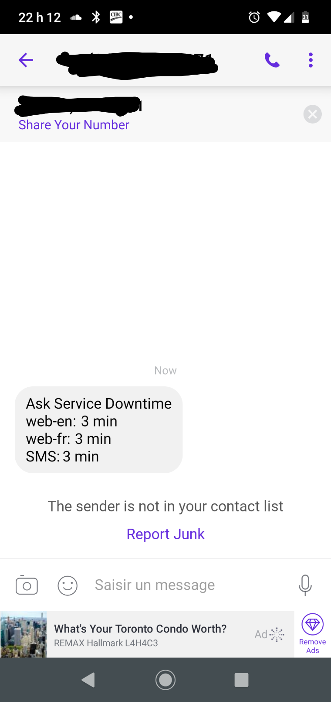

[


](https://pypi.org/project/ask_schools/)
[](https://travis-ci.org/guinslym/ask_schools)

<hr/>

## SP ASK Service SMS Alert script

Script to ping our 3  main LibraryH3lp services (web, clavardez, sms) and if any of those queues are closed during standard Ask opening Hours for more than 10 minutes then this script will send an SMS to the Scholars-Portal Ask coordinator
<br/>


## Screenshots
This is a mockup, it will only send if one of the services has been down for at least 10 minutes
<p float="left">
    
</p>

## Installation


**SP ASK Service SMS Alert** is not a package but a **script** and can run by typing this in the terminal:

```
## using pip 
pip install -r requirements.txt
python sp_ask_service_availability_alert.py

## or using poetry
poetry install 
poetry run python sp_ask_service_availability_alert.py

## if Using the Makefile
make setup 
# then.. 
make run
```
In addition it is useful to execute it from **crontab**
`*/15 * * * * python sp_ask_service_availability_alert.py`

## Requirement
1.  This script requires a TWILIO account credentials to send SMS 
2.  This script requires a .env file 

```text

# .env
ACCOUNT_SID="Twillio account sid"
AUTH_TOKEN="twillio auth token"
FROM="phone number"
TO="phone number"
```


## Todo

1.  Replace SMS with email to ASK SP inbox
2.  Add tests
3.  ~~Add Docker~~
4.  Move the logic to create a Mobile app

